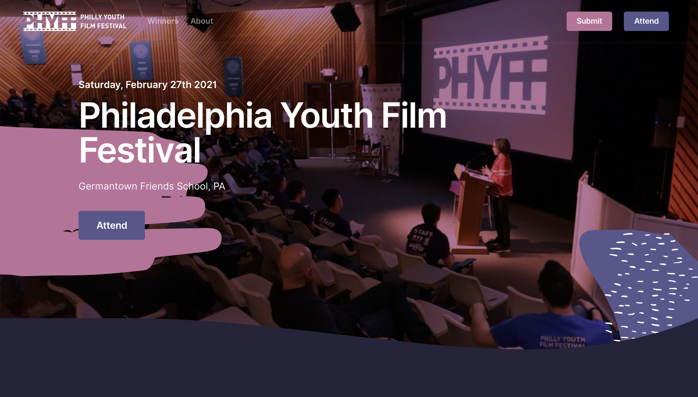

# PHYFF Public

#### 🎞 The public site for the Philadelphia Youth Film Festival

PHYFF is a student-run event dedicated to helping teenage creatives find their voice in a rapidly expanding community of young filmmakers. The Festival is free to attend for all high school students and is being hosted at Germantown Friends School.

*Soon hosted at **[phyff.com](https://phyff.com)***

## 🎉 New Site

This version of the site is built with react and completely redesigned using the [Leap Bootstrap Theme](https://themes.getbootstrap.com/product/leap-multipurpose-bootstrap-theme/).
It pulls all of its variable data from a [Firestore](https://firebase.google.com/docs/firestore) database,
the information in which can be easily edited via the [Admin Dashboard](https://github.com/phyff/admin).

#### Changes

The changes to the codebase have allowed us to 
implement the following **critical improvements**:
* Client-side rendering for dynamic content
* Beautiful & modular design thanks to [Leap](https://themes.getbootstrap.com/product/leap-multipurpose-bootstrap-theme/)
* Modular code architecture for development & design ease
* Lazy loading & codesplitting for network efficiency
* Automatically updating content with [Firestore](https://firebase.google.com/docs/firestore) and the new [Admin Dashboard](https://github.com/phyff/admin)

Notable changes to the site's content include:
* PHYFF Summary video on splash page
* Full festival schedule
* Display of winners from past years
* Sign-up form embedded in site
* More images (people love images)

The following information is pulled from the [Firestore](https://firebase.google.com/docs/firestore) 
database and can be updated through the [Admin Dashboard](https://github.com/phyff/admin):
* Team members
* Workshops & schedule
* Sponsors
* Winners from past festivals
* Event info, such as
    * Date & Location
    * Submission deadline
    * Promo video (appears on splash page)
    * Signup form link
    

## ⚙️ Contributing

For new designers & web developers, there are a few things to consider
when contributing to the website. You should be somewhat familiar with
the tools and languages used to build the website, but if you are not,
you'll likely still be able to contribute. If you find yourself confused
by the web development specifics, reach out to Robert May (rmay21@germantownfriends.org)
or Sequoyah Sudler (ssudler21@germantownfriends.org).

#### 🖥 Developing

Use the following commands during development:

| Script | Environment | Purpose |
| ------ | ----------- | ------ |
|`npm run dev`| Development | Starts development server with hot reloading. |
|`npm run gulp` | Development | Builds the site's Sass & JavaScript plugins to the public directory, automatically rebuilds on file changes. |
|`npm run lint` | Development | Lints the `src` directory using ESLint. |
|`npm run build` | Production | Builds the site's static bundle in production mode to the build directory. |
|`npm run start` | Production | Starts the production server that serves the built website. |

#### 🛠 Tools & Languages

Tools you should be familiar with to contribute to the site include:
* [React](https://reactjs.org/)
* [Bootstrap](https://getbootstrap.com/)
* [React Bootstrap](https://react-bootstrap.github.io/)
* [GitHub](https://github.com/)

If you want to modify the build process of the site, you should be 
familiar with the following tools:
* [Webpack](https://webpack.js.org/)
* [Gulp](https://gulpjs.com/) 

If you're interested in working with the server, you should be
familiar with the following tools:
* [Express](https://expressjs.com/)
* [Node.js](https://nodejs.org/en/)

Languages used in the core development of this site include:
* [JavaScript](https://www.javascript.com/) (specifically [JSX](https://reactjs.org/docs/introducing-jsx.html))
* [Sass](https://sass-lang.com/)
* HTML and CSS

#### 🖼 Resources

For general branding/website resources, use the PHYFF Google Drive
(which should be shared with all members of the PHYFF team) or the
[resources repository](https://github.com/phyff/resources).

#### 🎨 Code Style Guidelines

Use [ESLint](https://eslint.org/) to maintain consistent codestyle throughout
development. We are using [Airbnb's ESLint config](https://www.npmjs.com/package/eslint-config-airbnb).
Don't worry about installing these tools; they're already setup in this project.

##### 🖌 Writing custom Sass

If you need to define custom variables with Sass, define them
in `src/assets/scss/user-variables.scss`. Make sure to set
their values in `$theme-color-scheme`, `$theme-colors`, and
the export statement at the bottom of the file.

If you need to write custom styles with Sass, write them in
`src/assets/scss/user.scss`. Denote the purpose of your styles
with comments.

**Do not modify any of the other files in the `src/assets/scss/`
directory**

##### 🧩 Writing new React elements

Any *all-purpose components* that are likely to be used in *top-level*
or *multiple other* React elements should be in the `src/components/`
directory.

Any new *pages* should have their own folder in the `src/domain` directory,
containing a file named after the page (e.g. `src/domain/NewPage`) and a components
directory (e.g. `src/domain/NewPage/components/`) containing the components
used only or mainly by the page. Subcomponents of the page can have
their own directory and components directory as well.

##### 📝 Writing JavaScript helpers

Any JavaScript files containing *general helper functions* should
be in the `src/helpers/` directory.

Any JavaScript files holding *static or placeholder data* for use in
testing the site or prioritizing modularity should be in the
`src/data/` directory.

Any *functions* used to *wrap React components* in other React components
(such as wrapping page content in a navbar and a footer in
`src/hocs/withBaseLayout.jsx`) should be in the `src/hocs/` directory.

Any custom *React hooks* used for *asynchronously fetching or manipulating data* and
*using a state or effect* should be in the `src/hooks/` directory.

Any *reusable types* defined with [PropTypes](https://reactjs.org/docs/typechecking-with-proptypes.html)
should be in the `src/types/` directory.

Always follow [ESLint](https://eslint.org/) rules when writing JavaScript.
If you have to bypass any rules for any reason, make sure to briefly explain
why in a comment.

##### 👩‍💻 Using GitHub

When adding a new feature or a large amount of new content it's recommended 
that you make a new branch from the `main` branch. You can then make a pull request so
that whoever else needs to review the changes can do so easily.

If it's just a hotfix or small content change then just updating `main` should be fine.
Keep it to one commit (or multiple in quick succession) since we don't want any
unfinished stuff lying around in `main`.

When making a new commit, **please prefix your commit message with an emoji**.
I know this might seem like an odd request, but adding some color and
visuals to our commit messages makes the repository much more inviting
and the commit history much more readable.
